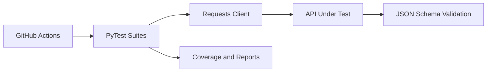

# API Test Automation Framework

[](https://github.com/PhilipOkeke/api-testing-framework/actions/workflows/ci.yml)
[](https://www.python.org/)
[](https://pytest.org/)

A reusable black-box API testing framework built with Python and PyTest. It tests the [TaskFlow REST API](https://github.com/PhilipOkeke/taskflow-backend-api) through real HTTP requests, validates response contracts, covers complete CRUD workflows, and publishes test reports in CI.


## Architecture



This repository demonstrates both **QA automation** and **software development** skills: maintainable package design, clean abstractions, typed Python, test data management, environment configuration, and automated delivery checks.

## What this framework tests

- Service health and availability
- Create, read, update, and delete task workflows
- Status and priority filters
- Search and pagination
- Invalid payloads and query parameters
- Missing resources and consistent API errors
- JSON response contracts using Draft 2020-12 schemas
- Automated cleanup so tests remain independent and repeatable

## Technology

| Area | Tools |
|---|---|
| Test runner | PyTest |
| HTTP client | Requests |
| Contract testing | JSON Schema |
| Reports | pytest-html and JUnit XML |
| Code quality | Ruff |
| Manual/API exploration | Postman |
| Continuous integration | GitHub Actions |

## Framework design

```text
tests/                         Business-readable test scenarios
        │
        ▼
TaskFlowClient                 Reusable HTTP operations
        │
        ├── Settings           Environment-based configuration
        ├── Factories          Unique, repeatable test data
        ├── Assertions         Status, error, and contract checks
        └── JSON Schemas       API response contracts
```

Tests focus on expected behavior. Request construction, configuration, data generation, and common assertions live in reusable modules, so the suite is easier to extend and maintain.

## Run locally

### 1. Start the TaskFlow API

In the TaskFlow API repository:

```bash
python -m venv .venv
```

Activate the environment on Windows:

```powershell
.venv\Scripts\Activate.ps1
```

Then install and run the API:

```bash
pip install -e ".[dev]"
uvicorn app.main:app --reload
```

The API should be available at `http://127.0.0.1:8000`.

### 2. Run the automated tests

Open a second terminal in this repository:

```bash
python -m venv .venv
```

Activate it on Windows:

```powershell
.venv\Scripts\Activate.ps1
```

Install and run:

```bash
pip install -e ".[dev]"
pytest
```

To create browser-friendly and CI-friendly reports:

```bash
pytest --html=reports/api-test-report.html --self-contained-html --junitxml=reports/junit.xml
```

## Select test suites

Run the critical smoke tests:

```bash
pytest -m smoke
```

Run the wider regression suite:

```bash
pytest -m regression
```

Point the framework at another environment with variables:

```powershell
$env:BASE_URL = "https://test.example.com"
$env:REQUEST_TIMEOUT = "15"
pytest
```

## Postman collection

The `postman/` folder contains a collection and local environment. Import both JSON files into Postman, select **TaskFlow Local**, start the TaskFlow API, and run the collection from top to bottom. The create request automatically saves the new task ID for the later requests.

## Continuous integration

The GitHub Actions workflow:

1. Checks out this framework and the TaskFlow API.
2. Installs both projects in Python 3.12.
3. runs lint and formatting checks.
4. Starts the API and waits for a healthy response.
5. Executes all tests with coverage enforcement.
6. Uploads HTML and JUnit reports, even when a test fails.

## Project structure

```text
api-testing-framework/
├── .github/workflows/ci.yml
├── postman/
│   ├── TaskFlow_API.postman_collection.json
│   └── TaskFlow_Local.postman_environment.json
├── scripts/wait_for_api.py
├── src/taskflow_test_framework/
│   ├── assertions.py
│   ├── client.py
│   ├── config.py
│   ├── factories.py
│   └── schemas/
├── tests/
│   ├── conftest.py
│   ├── test_health.py
│   ├── test_negative_cases.py
│   ├── test_task_crud.py
│   └── test_task_filters.py
├── .env.example
├── LICENSE
└── pyproject.toml
```

## Author

**Philip Okeke**  
Software Engineer | Backend Developer | QA Automation Engineer

- Email: [Engr.philipokeke@gmail.com](mailto:Engr.philipokeke@gmail.com)
- LinkedIn: [linkedin.com/in/philip-okeke-8148a42a4](https://www.linkedin.com/in/philip-okeke-8148a42a4)
- GitHub: [github.com/PhilipOkeke](https://github.com/PhilipOkeke)
